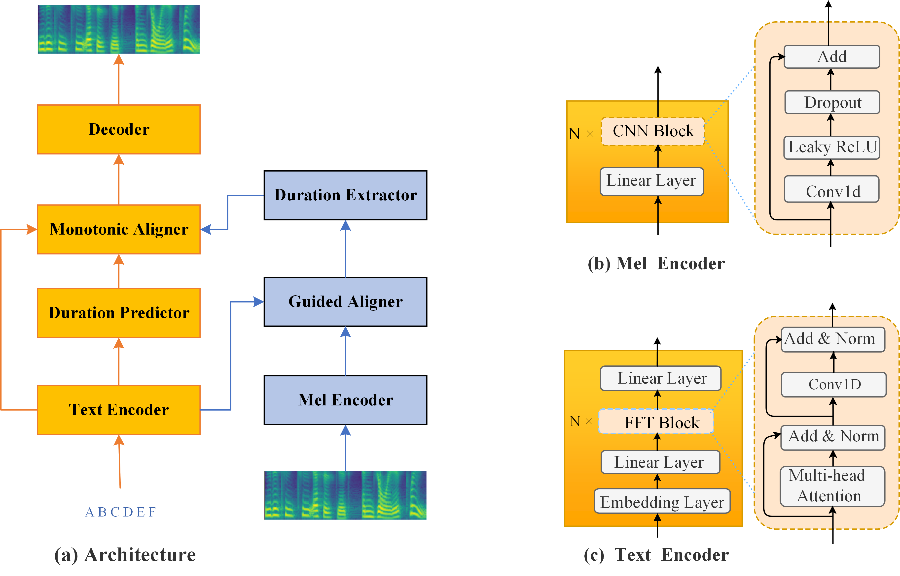

# Pytorch implementation of  ***Eden-TTS: A Simple and Efficient Parallel Text-to-speech Architecture with Collaborative Duration-alignment Learning***

We propose Eden-TTS, a simple and efficient parallel TTS architecture which jointly learns duration prediction, text-speech alignment and speech generation in a single fully-differentiable model. The alignment is learned implicitly in our architecture. A novel energy-modulated attention mechanism is proposed for alignment guidance which leads to fast and stable convergence of our model. Our model can be easily implemented and trained. 

Listen the audio samples: **[audio samples](https://edenynm.github.io/edentts-demo/)**

## architecture


## train the model using ljspeech
- download the [ljspeech](https://keithito.com/LJ-Speech-Dataset/) and extract it 
- clone this repo: `git clone https://github.com/edenynm/eden-tts.git`
- run  `python preprocess_ljs.py -p  path/to/ljspeech` for training data preparation
- run `python train.py` to do the training.  You may want to check the `hparams.py` for experiment settings before running
- download pretrained vocoder from [hifigan pretrained model](https://drive.google.com/drive/folders/1-eEYTB5Av9jNql0WGBlRoi-WH2J7bp5Y), and set **voc_path** in `hparams.py` to the downloaded hifigan vocoder path.
- When the training finishes, run `python inference.py -t  "input text"` for speech generation. 


## reference

### git respository
1. [WaveRNN](https://github.com/fatchord/WaveRNN)
2. [fastspeech](https://github.com/xcmyz/FastSpeech)
3. [tacotron](https://github.com/keithito/tacotron)
4. [efficient_tts](https://github.com/liusongxiang/efficient_tts)

## cite our article
If you find the method helpful, you may cite the following article.
```
@inproceedings{ma23c_interspeech,
  author={Youneng Ma and Junyi He and Meimei Wu and Guangyue Hu and Haojun Fei},
  title={{EdenTTS: A Simple and Efficient Parallel Text-to-speech Architecture with Collaborative Duration-alignment Learning}},
  year=2023,
  booktitle={Proc. INTERSPEECH 2023},
  pages={4449--4453},
  doi={10.21437/Interspeech.2023-700}
}
```